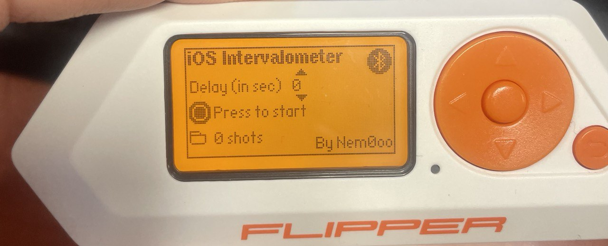
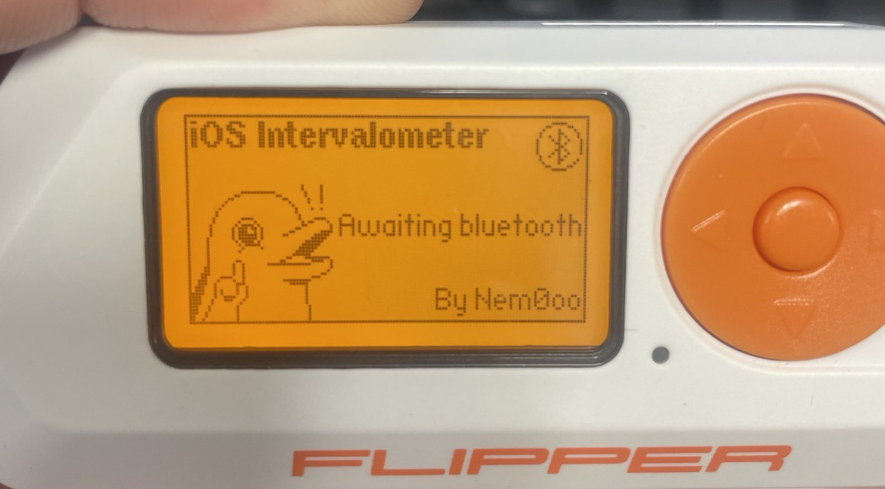

# Flipper Zero — Bluetooth Camera Trigger

A Bluetooth intervalometer for the Flipper Zero, built to trigger an iPhone/Android camera remotely with a configurable number of shots and interval between them.

  
  

## Why

I wanted to shoot Milky Way timelapses with my iPhone. Those triggers exist for DSLR but I didn't find any for iPhone — the Flipper Zero was sitting on my desk and I wanted to learn.

## What it does

- Connects to an iPhone/Android via Bluetooth
- Triggers the camera shutter remotely
- Configurable number of shots and interval between them

## Result

[First try](https://e.pcloud.link/publink/show?code=XZLjIiZTka72V9i4eQB91O28Cs5W8ePglhV)

## Note

This app has since been forked and is available on the [Flipper App Store](https://lab.flipper.net/apps/bt_trigger).
